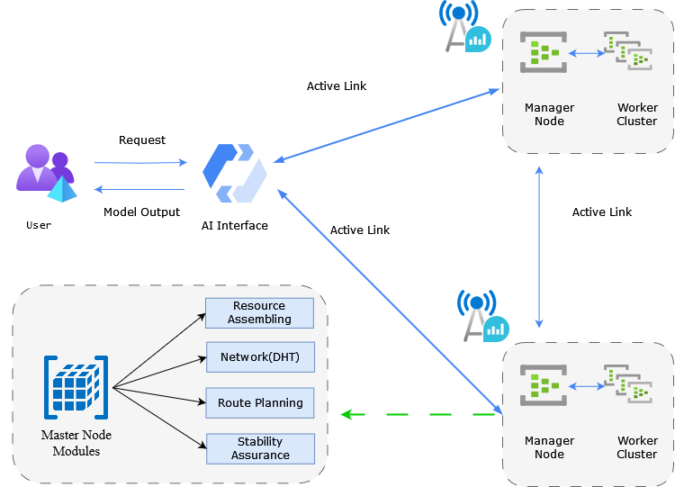

# Turbulence

**Turbulence** is a high-performance, distributed scheduling framework designed for the orchestration of large-scale machine learning models. It provides a robust and scalable solution to manage computational resources efficiently, ensuring that model training and inference tasks are executed with optimal performance.

## Key Features

- **Scalability**: Built to scale out across multiple nodes, Turbulence can handle workloads from small research projects to large production environments.
- **Flexibility**: Supports a wide range of deep learning frameworks and cloud platforms, making it easy to integrate into existing infrastructure.
- **Efficiency**: Optimized scheduling algorithms ensure that computational resources are utilized to their fullest potential, minimizing idle time and reducing costs.
- **Ease of Use**: A simple API and intuitive configuration options make it accessible to both beginners and experienced practitioners.
- **Monitoring & Management**: Comprehensive monitoring and management tools allow for real-time tracking of job statuses and resource utilization.
- **Security**: Implements industry-standard security practices to protect data and ensure secure communication between nodes.

## Getting Started

For detailed instructions on how to get started with Turbulence, including installation, configuration, and deployment, please refer to our [documentation](link_to_documentation).

## Contributing

We welcome contributions from the community! If you wish to contribute to the development of Turbulence, please read our [contribution guidelines](link_to_contributing) before submitting a pull request.

## License

Turbulence is released under the [Apache 2.0 License](LICENSE). See the `LICENSE` file for more details.

## Community

Join the conversation and connect with other users and contributors in our [community forums](link_to_forum) or [chat room](link_to_chat_room). We're here to help and support each other.

## Acknowledgments

A special thanks to all the contributors and the open-source community for their valuable feedback and support. Your contributions have been instrumental in shaping Turbulence into what it is today.
